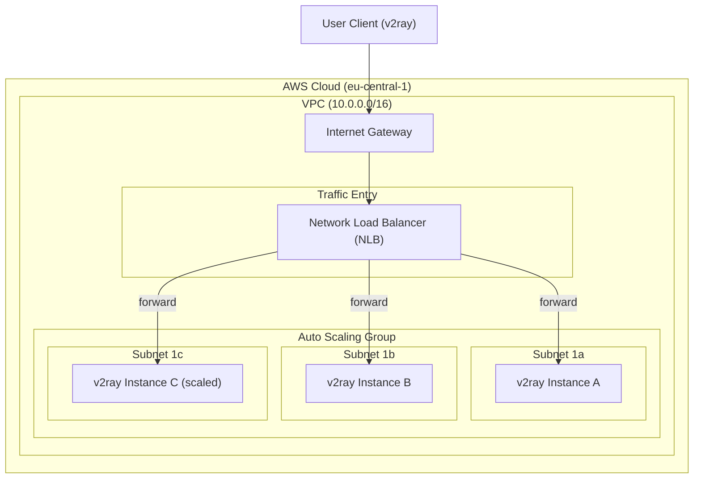

# AWS v2ray Proxy Autoscaling Cluster

[](https://www.terraform.io/)
[](https://aws.amazon.com/)
[](LICENSE)

A production-ready Terraform configuration to deploy an autoscaling cluster of [v2ray](https://www.v2fly.org/) proxy servers behind an AWS Network Load Balancer (NLB) in the `eu-central-1` (Frankfurt) region.

---

## 🗺 Architecture Diagram

This setup distributes client traffic across a dynamic group of EC2 instances running v2ray. The instances auto-scale based on CPU utilization and span three separate Availability Zones (`eu-central-1a`, `eu-central-1b`, and `eu-central-1c`) for high availability.



---

## ✨ Features

* **High Availability:** Spans three subnets in separate Availability Zones.
* **Auto Scaling:** Scales out to 3 nodes and scales in to 1 node based on Average CPU Utilization (target tracking at 70%).
* **Network Load Balancer (NLB):** Provides a single entry point (DNS name) for proxy traffic, forwarding raw TCP connections with low latency.
* **Zero-Touch Provisioning (User Data):** Every instance is bootstrapped automatically at launch using a shell script that installs, starts, and enables the `v2ray` service.
* **Cost Optimized:** EBS volumes are reduced to 20 GB `gp3` (which is more than enough for a proxy node) and configured to auto-delete when instances terminate.

---

## 📁 Repository Structure

* [ec2.tf](file:///Users/aleksandrandreichenko/work/github/v2ray-aws/ec2.tf) - Defines the Network Load Balancer, Launch Template (with boot script), ASG, and CPU scaling policy.
* [network.tf](file:///Users/aleksandrandreichenko/work/github/v2ray-aws/network.tf) - Defines the custom VPC, subnets across three different AZs, IGW, and routing.
* [security_group.tf](file:///Users/aleksandrandreichenko/work/github/v2ray-aws/security_group.tf) - Defines the ingress/egress rules.
* [variables.tf](file:///Users/aleksandrandreichenko/work/github/v2ray-aws/variables.tf) - Defines variables including instance types, scaling sizes, and custom ports.
* [outputs.tf](file:///Users/aleksandrandreichenko/work/github/v2ray-aws/outputs.tf) - Exposes outputs, including the entry point NLB DNS name.

---

## 🚀 Quick Start & Deployment

### 1. Prerequisites
* [Terraform](https://developer.hashicorp.com/terraform/downloads) >= 0.12.0 installed.
* [AWS CLI](https://aws.amazon.com/cli/) configured.
* Public SSH key available at `~/.ssh/id_rsa.pub`.

### 2. Deploy
Run the standard Terraform workflow:

```bash
terraform init
terraform plan
terraform apply
```

On successful completion, Terraform outputs the Network Load Balancer DNS name:
`v2ray-nlb-dns-name = "<nlb-id>.elb.eu-central-1.amazonaws.com"`

---

## ⚙️ Configuration Variables (Inputs)

| Name | Description | Type | Default | Required |
|------|-------------|------|---------|:--------:|
| instance\_type | The main type of instance in this case | `string` | `"t3.micro"` | no |
| v2ray\_port | The port v2ray will listen on (and NLB forwards to) | `number` | `443` | no |
| asg\_min\_size | Minimum number of instances in the ASG | `number` | `1` | no |
| asg\_max\_size | Maximum number of instances in the ASG | `number` | `3` | no |
| asg\_desired\_capacity | Desired number of instances in the ASG | `number` | `2` | no |

---

## 📤 Outputs

| Name | Description |
|------|-------------|
| v2ray-nlb-dns-name | The entry point DNS name of the Network Load Balancer |
| vpc\_common | The CIDR block of the VPC |
