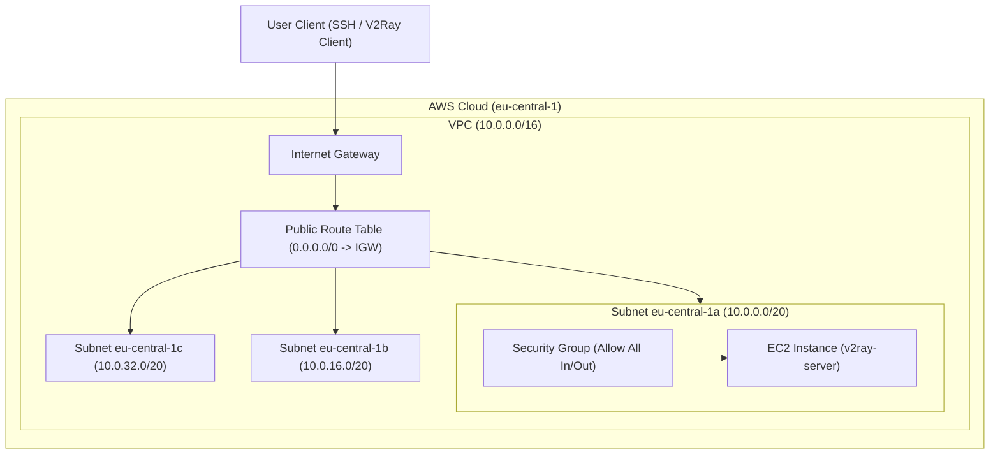

# AWS v2ray Proxy Infrastructure

[](https://www.terraform.io/)
[](https://aws.amazon.com/)
[](LICENSE)

A Terraform-based infrastructure configuration to provision a secure, high-performance [v2ray](https://www.v2fly.org/) proxy server on Amazon Web Services (AWS) in the `eu-central-1` (Frankfurt) region.

---

## 🗺 Architecture Diagram

The deployed infrastructure configures a custom VPC with multiple subnets, routes internet traffic through an Internet Gateway, and provisions a dedicated EC2 instance inside a wide-open security group to run the proxy service.



---

## 📁 Repository Structure

* [ec2.tf](file:///Users/aleksandrandreichenko/work/github/v2ray-aws/ec2.tf) - Provisions the EC2 instance, configures the SSH key, and sets up a 300GB `gp3` root volume.
* [network.tf](file:///Users/aleksandrandreichenko/work/github/v2ray-aws/network.tf) - Defines the VPC, 3 public subnets, Internet Gateway, and Route Table associations.
* [security_group.tf](file:///Users/aleksandrandreichenko/work/github/v2ray-aws/security_group.tf) - Configures the ingress/egress rules to allow proxy and SSH traffic.
* [variables.tf](file:///Users/aleksandrandreichenko/work/github/v2ray-aws/variables.tf) - Houses configurable parameters such as instance type, CIDR ranges, and region.
* [outputs.tf](file:///Users/aleksandrandreichenko/work/github/v2ray-aws/outputs.tf) - Exposes outputs like the server's public IP address.
* [providers.tf](file:///Users/aleksandrandreichenko/work/github/v2ray-aws/providers.tf) - Configures AWS providers and settings.
* [backend.tf](file:///Users/aleksandrandreichenko/work/github/v2ray-aws/backend.tf) - Handles backend configuration.

---

## 🚀 Quick Start & Deployment

### 1. Prerequisites
* [Terraform](https://developer.hashicorp.com/terraform/downloads) >= 0.12.0 installed.
* [AWS CLI](https://aws.amazon.com/cli/) installed and configured with credentials.
* SSH Public Key generated at `~/.ssh/id_rsa.pub` (used to gain SSH access to the server).

### 2. Initialize and Deploy
Run the standard Terraform workflow to provision the infrastructure:

```bash
# Initialize the backend and providers
terraform init

# Preview changes before applying
terraform plan

# Create the infrastructure on AWS
terraform apply
```

---

## ⚙️ Configuration Variables (Inputs)

| Name | Description | Type | Default | Required |
|------|-------------|------|---------|:--------:|
| instance\_type | The main type of instance in this case | `string` | `"t2.micro"` | no |
| profile | The main profile for aws credentials | `string` | `"default"` | no |
| region-common | The main region | `string` | `"eu-central-1"` | no |
| vpc\_cidr\_block | The IPv4 CIDR block of the VPC | `string` | `"10.0.0.0/16"` | no |
| vpc\_name | The Name of the VPC | `string` | `"v2ray VPC"` | no |

---

## 📤 Outputs

| Name | Description |
|------|-------------|
| v2ray-server-public-ip | The public IP address of the deployed proxy server |
| vpc\_common | The CIDR block of the VPC |

---

## 🛠 Post-Deployment Setup (Configuring v2ray)

Once Terraform completes the deployment, retrieve the server's public IP using `terraform output v2ray-server-public-ip`.

### 1. Connect to the EC2 Instance
Log into the server using the configured SSH key:
```bash
ssh ec2-user@<v2ray-server-public-ip>
```

### 2. Install v2ray
Run the official installation script on the EC2 instance to set up v2ray:
```bash
# Install v2ray
bash <(curl -L https://raw.githubusercontent.com/v2fly/fscript/master/fscript.sh)
```

### 3. Start the Service
Enable and start the service daemon:
```bash
sudo systemctl enable v2ray
sudo systemctl start v2ray
```
