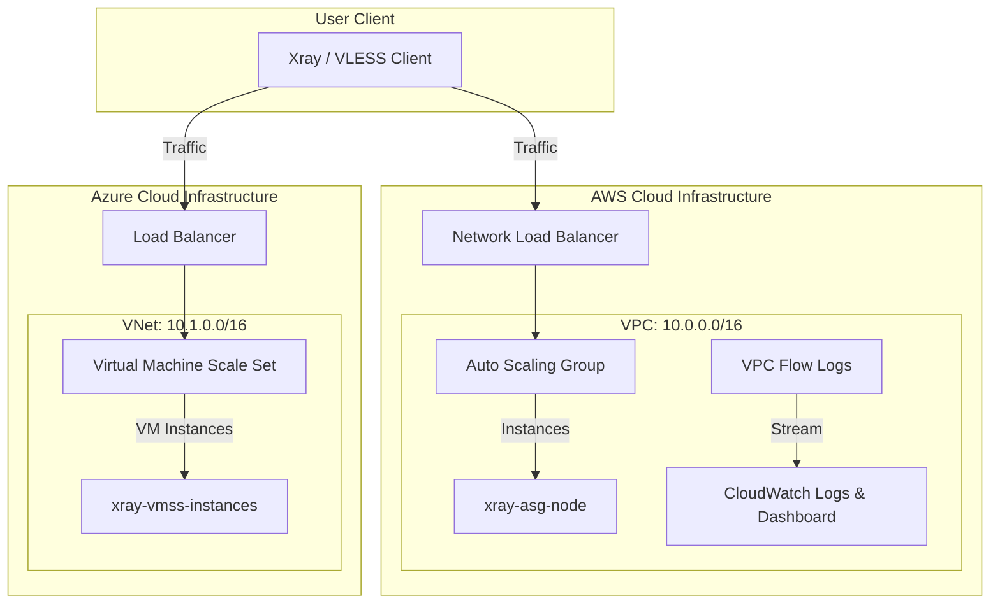

# Multi-Cloud Xray Proxy Cluster (AWS & Azure)

[](https://www.terraform.io/)
[](https://aws.amazon.com/)
[](https://azure.microsoft.com/)
[](LICENSE)

Production-ready, highly available, and autoscaling multi-cloud deployment configuration for [Xray-core](https://github.com/XTLS/Xray-core) (high-performance VPN/Proxy tunnel). The project provisions parallel infrastructure stacks in both **Amazon Web Services (AWS)** and **Microsoft Azure**, complete with network load balancing, auto-scaling, and deep network traffic monitoring.

---

## 🗺 Architecture Diagram



---

## ✨ Features

* **Xray-core Migration**: Replaced legacy V2Ray with high-performance Xray-core utilizing the official installer and optimized boot scripts.
* **Multi-Cloud Parity**:
  * **AWS**: Deploys an EC2 Auto Scaling Group behind a Network Load Balancer (NLB) across three availability zones.
  * **Azure**: Deploys a Linux Virtual Machine Scale Set (VMSS) behind a Standard Azure Load Balancer.
* **Auto-Scaling**: Scales compute instances out or in based on CPU utilization metrics dynamically in both clouds.
* **Network Traffic Monitoring (AWS)**:
  * **VPC Flow Logs**: Captures ip traffic details on subnet interfaces.
  * **CloudWatch Dashboard**: Aggregate views for total `NetworkIn`, `NetworkOut`, and average CPU load.
  * **Metric Alarms**: CloudWatch alarm triggered automatically when network outbound traffic spikes (e.g., above 50 GB threshold).
* **Bootstrapping**: Automatic deployment of Xray-core on startup via Cloud-Init/User Data.

---

## 📁 Repository Structure

* [ec2.tf](file:///Users/aleksandrandreichenko/work/github/v2ray-aws/ec2.tf) - AWS Compute resources (Launch Template, ASG, ASG Scaling, Load Balancer).
* [network.tf](file:///Users/aleksandrandreichenko/work/github/v2ray-aws/network.tf) - AWS network topology (VPC, three subnets, IGW, Routing).
* [monitoring.tf](file:///Users/aleksandrandreichenko/work/github/v2ray-aws/monitoring.tf) - AWS Traffic monitoring (VPC Flow Logs, CloudWatch Dashboard, Traffic Alarm).
* [azure.tf](file:///Users/aleksandrandreichenko/work/github/v2ray-aws/azure.tf) - Azure parity resources (Resource Group, VNet, Load Balancer, VMSS, VMSS Autoscale).
* [security_group.tf](file:///Users/aleksandrandreichenko/work/github/v2ray-aws/security_group.tf) - AWS network firewall rules.
* [providers.tf](file:///Users/aleksandrandreichenko/work/github/v2ray-aws/providers.tf) & [backend.tf](file:///Users/aleksandrandreichenko/work/github/v2ray-aws/backend.tf) - Multi-cloud provider definitions and state backend.

---

## 🚀 Execution & Deployment Guide

### Prerequisites
* Terraform `>= 1.5.0`
* AWS CLI and Azure CLI (`az login`) configured.
* Public SSH key available at `~/.ssh/id_rsa.pub`.

### Step-by-Step Deployment
1. **Initialize Terraform plugins**:
   ```bash
   terraform init
   ```
2. **Preview provisioning plans**:
   ```bash
   terraform plan
   ```
3. **Apply resource changes**:
   ```bash
   terraform apply
   ```

---

## ⚙️ Configuration Variables (Inputs)

| Name | Description | Type | Default | Required |
| :--- | :--- | :--- | :--- | :---: |
| `instance_type` | Instance size for AWS EC2 nodes | `string` | `"t3.micro"` | no |
| `xray_port` | Inbound traffic listening port for Xray | `number` | `443` | no |
| `asg_min_size` | Scale set / ASG minimum nodes | `number` | `1` | no |
| `asg_max_size` | Scale set / ASG maximum nodes | `number` | `3` | no |
| `asg_desired_capacity` | Scale set / ASG initial count | `number` | `2` | no |

---

## 📤 Outputs

* `xray-nlb-dns-name`: Public DNS of the AWS Network Load Balancer.
* `az_xray_lb_public_ip`: Public IP address of the Azure Load Balancer.
* `vpc_common`: AWS VPC CIDR block.
* `route-table`: Public Route Table ID.
